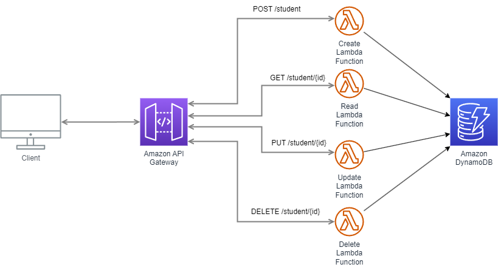

# aws-student-management

This project contains source code of a serverless CRUD microservice. Built in java 11, the application uses the following AWS services: Lambda DynamoDB and API Gateway.

## Architecture

The architecture is a standard one captured in the following diagram:

## Prerequisites
## Getting started
## Using the service
## Cleanup